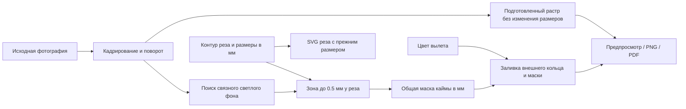

# Исправление светлой каймы у вылета

В исходном изображении шахматной эмблемы обнаружены непрозрачные почти белые
пиксели у края подготовленного растра (примерно 3–6 px). Внешнее кольцо и даже
сплошная подложка под изображением не могут заменить непрозрачную белую кайму.
Отдельное округление координат изображения в PNG также сдвигало стык относительно
векторного вылета на долю пикселя.

Опция «Скрыть светлую кайму» включена по умолчанию и действует только при вылете
больше нуля. Отключение сохраняет намеренную белую рамку исходника.

1. После кадрирования и поворота выполняется построчный поиск почти белого фона,
   связанного с внешней границей изображения. Прозрачность допускает связность,
   но сама не закрашивается. Кандидаты: alpha = 255, минимум RGB ≥ 225,
   разброс RGB ≤ 30. Полупрозрачные пиксели также сохраняются.
2. Из найденного фона выбирается узкая зона у контура реза глубиной до 0.5 мм.
   Круг и скруглённый прямоугольник учитываются по физическому контуру.
3. Маска в миллиметрах сохраняется отдельно от исходника и цвета. При изменении
   цвета она сразу перекрашивается без повторного декодирования фотографии.
4. Предпросмотр, PNG и PDF наносят одинаковую маску поверх изображения, ограничивая
   её внешним контуром вылета. Исходник, масштаб, размеры реза и раскладка сохраняются.
   Погрешность растровой границы составляет до одного исходного пикселя; строки
   маски перекрываются максимум на 0.01 мм, чтобы не создавать щели сглаживания.

Внешняя заливка снова выводится кольцом: прозрачные отверстия PNG и внутренние
поля «Вписать» остаются белой бумагой. Маска не затрагивает изолированные белые
детали, насыщенные цветные блики или фон дальше 0.5 мм от реза. Для широких белых
полей требуется ручное кадрирование; эта опция исправляет узкую светлую кайму.

Проверка на исходной эмблеме 835 × 835 px: наклейка 35.5 × 35.5 мм, вылет 3 мм,
цвет `#0026B5`, A4 297 × 210 мм, 600 DPI. В PNG число почти белых пикселей в зоне
стыка снизилось с 13 387 до 0; глубже 0.6 мм от реза не изменился ни один пиксель.
Растеризация PDF при 600 DPI также дала 0 светлых пикселей в зоне стыка. Размер
страницы PDF — 297 × 210 мм; один растр используется всеми 35 копиями. Прозрачное
отверстие и внутреннее поле в отдельном PNG остались белой бумагой.
