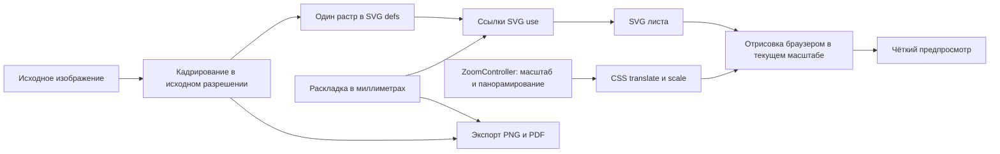

# Чёткость предпросмотра при увеличении

Предпросмотр использует SVG в миллиметрах, подготовленный растр изображения в
исходном разрешении и повторные ссылки `<use>` на одну копию рисунка. Увеличение
листа выполняет `ZoomController` через CSS `translate(...) scale(...)`.

Постоянный `will-change: transform` на `.sheet-shadow-wrapper` позволял Chromium
сохранять растр слоя, сформированный при меньшем масштабе. Увеличение такого слоя
растягивало уже уменьшенный предпросмотр. Детали терялись даже при качественном
исходнике и высоком значении DPI. Результат зависел от последовательности
увеличения и момента растеризации слоя, поэтому мог различаться между вкладками.

Флаг удалён: браузер самостоятельно выбирает слои и перерисовывает SVG с учётом
текущего масштаба. Принудительная растеризация листа в Canvas или увеличение
исходника для исправления не требуются.

Механизм описан в документации Chromium:
[Re-rastering composited layers on scale change](https://developer.chrome.com/blog/re-rastering-composite/).

## Диагностика

На 9 октября 2026 года опубликованные JS и CSS `stickerfit.vercel.app` побайтно
совпали с локальной production-сборкой до исправления. Во всех трёх режимах
(Vite dev, локальная production-сборка, Vercel) эмблема оставалась 835 × 835 px.
При наклейке 35.5 × 35.5 мм эффективное разрешение составляет около 597 DPI.
Потеря деталей возникала на этапе экранного отображения.

Проверка при увеличении 400% и одинаковом DPR показала улучшение деталей после
отключения только `will-change`. Отключение SVG-фильтра тени при сохранении этого
флага проблему не устранило. Тень применяется лишь при нулевом вылете и количестве
до 40 наклеек; эта разница между исходными скриншотами не объясняет основную потерю
резкости.

Настройки сохраняются отдельно для каждого адреса через `localStorage`.
Для сравнения следует использовать одинаковые исходник, размеры, вылет, режим
«Вписать/Заполнить», масштаб предпросмотра и масштаб браузера. Надпись
«Масштаб печати: 100%» относится к печати; текущий масштаб предпросмотра показан
на панели увеличения.

## Проверка изменений

1. Выполнить `npm test` и `npm run build`.
2. Открыть dev-сервер и локальную production-сборку через `npm run preview`.
3. Загрузить один исходник, повторить увеличение колесом и кнопками до 400%,
   перетащить лист, сбросить масштаб и снова увеличить.
4. Сравнить детали внутри наклейки при одинаковом DPR; отдельно проверить вылет
   0 и 3 мм. На мобильном экране проверить pinch-to-zoom.

После исправления все 161 модульный тест и production-сборка прошли успешно.
Браузерная проверка той же эмблемы прошла следующие сценарии:

| Сценарий | Условия | Результат |
| --- | --- | --- |
| Колесо мыши | Dev и production, 400%, вылет 0 мм, DPR 1 | Резкость совпадает с контрольной отрисовкой |
| Кнопки, панорамирование, сброс и повторное увеличение | Production, 400%, вылет 3 мм, DPR 1.25 | Резкость совпадает с контрольной отрисовкой |
| Pinch-to-zoom | Production, экран 390 × 844, 400%, вылет 0 мм, DPR 2 | Резкость совпадает с контрольной отрисовкой |

Контрольная отрисовка — тот же SVG при том же масштабе с отключённым
`will-change`, после завершения перерисовки. Дисперсия лапласиана измерялась
внутри наклейки, исключая внешний контур. Для опубликованной версии до нового
деплоя она составила около 2216, для исправленной production-сборки — около
3675 при одинаковом увеличении колесом; размеры кадров и исходника совпадали.
Это показатель деталей изображения, а не DPI или физическое разрешение печати.

У SVG-элементов с изображением не следует добавлять постоянный
`will-change: transform` без проверки качества после увеличения. DPI исходника
и экранная чёткость проверяются отдельно.
