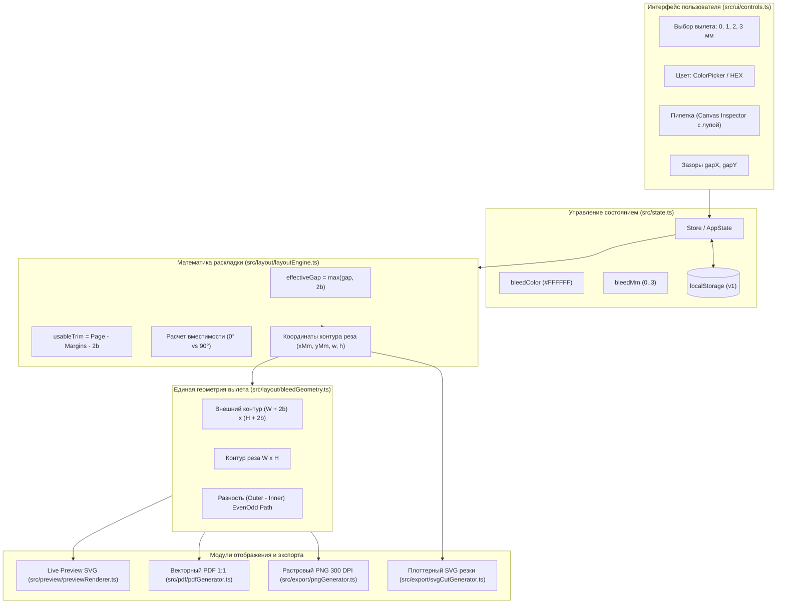

# Архитектурный план реализации: Цветной внешний вылет под обрез

**Ветка / Директория**: `specs/005-color-bleed-margin`  
**Дата создания**: 2026-10-09  
**Спецификация**: [spec.md](./spec.md)  
**Статус**: Plan Approved for Task Breakdown

**Исправление каймы (2026-10-09)**: общая маска светлого фона рассчитывается после
кадрирования в `src/image/edgeBackground.ts`, затем используется предпросмотром,
PNG и PDF поверх исходника. Глубина — до 0.5 мм от реза, цвет маски независим от
кадрирования. Опция `bleedEdgeCleanup` сохраняется в настройках. Полный поток
данных и результаты проверки: [исправление светлой каймы](../../docs/BLEED_EDGE_FIX.md).

---

## 1. Архитектурная диаграмма и поток данных

---

## 2. Затрагиваемые компоненты и файлы

| Файл / Модуль | Роль в реализации | Изменения | Трассировка требований |
|:---|:---|:---|:---|
| `src/layout/bleedGeometry.ts` *(новый)* | Единый источник истины геометрии вылета | Функции генерации SVG path разности (evenodd), координат внешнего контура и отрисовки для Canvas и PDF | FR-001, FR-005, FR-010, NFR-002, AC-001, AC-008 |
| `src/layout/layoutEngine.ts` | Ядро математики раскладки | Прием `bleedMm`, расчет `effectiveGapX/Y = max(gap, 2b)`, расчет `usableTrimWidth/Height`, координат `start`/`center`/`justify` с отступом вылета от полей | FR-009, FR-010, FR-011, FR-012, FR-013, FR-014, AC-002, AC-003, AC-004, AC-005 |
| `src/state.ts` | Управление состоянием | Добавление `bleedColor: string` (дефолт `#FFFFFF`) в `AppSettings` и `DEFAULT_SETTINGS`, безопасная загрузка из `localStorage`, валидация | FR-003, FR-020, AC-010 |
| `src/preview/previewRenderer.ts` | Векторный предпросмотр листа | Замена условной желтой области на внешнюю заливку цвета `bleedColor` без перекрытия внутреннего контура, контрастный контур реза | FR-005, FR-008, FR-018, AC-001, AC-007, AC-008 |
| `src/pdf/pdfGenerator.ts` | Генерация векторного PDF | Полное удаление растяжения фото, вывод картинки строго 1:1 по контуру реза, отрисовка цветного вылета разности через векторный путь `drawSvgPath` / прямоугольники | FR-001, FR-004, FR-005, FR-018, NFR-004, AC-001, AC-011 |
| `src/export/pngGenerator.ts` | Генерация растрового PNG | Удаление растяжения фото, отрисовка картинки 1:1 по контуру реза, отрисовка цветного вылета через `Path2D` / `clip` с `evenodd` | FR-001, FR-004, FR-005, FR-018, AC-001, AC-011 |
| `src/export/svgCutGenerator.ts` | Генерация SVG для плоттера | Гарантия: отсутствие вылетов и изменений размера контуров резки в SVG плоттера | FR-018, FR-019, AC-011 |
| `src/ui/eyedropper.ts` *(новый модуль/компонент)* | Интерактивная пипетка цвета | Захват пикселя с Canvas кадрированного/повернутого фото, лупа 8x с перекрестием, поддержка тача и мыши, отмена по Esc, проверка прозрачности | FR-003, FR-006, FR-007, NFR-005, AC-009 |
| `src/ui/controls.ts` | Контроллер интерфейса | Интеграция контролов вылета (выбор цвета, HEX с валидацией, кнопка пипетки), информирование о примененных зазорах `effectiveGap`, отображение изменения вместимости `20 → 15`, блокировка экспорта при capacity 0, авторасчет длины рулона | FR-003, FR-009, FR-014, FR-015, FR-016, FR-017, FR-020, AC-005, AC-006 |
| `index.html` | Разметка UI | Разметка блока выбора цвета вылета под `bleedSelect`, модалка/оверлей пипетки с лупой | FR-003, FR-006, FR-007, NFR-006 |
| `src/i18n.ts` | Локализация | Переводы всех новых терминов, пояснений зазоров, вместимости и ошибок на русском и английском языках | FR-021 |
| `src/styles.css` | Стили интерфейса | Стили для color picker, HEX input, кнопки пипетки, бейджей зазоров и вместимости, оверлея лупы | NFR-006 |

---

## 3. Математическая модель геометрии и раскладки

### 3.1. Эффективные зазоры
Для защиты от взаимного перекрытия зон вылетов соседних наклеек:
$$\text{effectiveGapX} = \max(\text{gapX}, 2 \cdot \text{bleedMm})$$
$$\text{effectiveGapY} = \max(\text{gapY}, 2 \cdot \text{bleedMm})$$

### 3.2. Доступная область реза (Trim Area) с учётом полей
Поля листа отсчитываются от внешнего края вылета. Следовательно, доступное пространство для контуров реза:
$$\text{usableTrimWidth} = \text{pageWidthMm} - \text{margins.left} - \text{margins.right} - 2 \cdot \text{bleedMm}$$
$$\text{usableTrimHeight} = \text{pageHeightMm} - \text{margins.top} - \text{margins.bottom} - 2 \cdot \text{bleedMm}$$

Количество колонок и строк:
$$\text{columns} = \left\lfloor \frac{\text{usableTrimWidth} + \text{effectiveGapX} + \varepsilon}{W + \text{effectiveGapX}} \right\rfloor$$
$$\text{rows} = \left\lfloor \frac{\text{usableTrimHeight} + \text{effectiveGapY} + \varepsilon}{H + \text{effectiveGapY}} \right\rfloor$$

### 3.3. Координаты контуров реза
Для каждого экземпляра $(c, r)$, где $c \in [0, \text{cols}-1]$, $r \in [0, \text{rows}-1]$:
- Ширина сетки по контурам реза: $\text{gridTrimW} = \text{cols} \cdot W + (\text{cols} - 1) \cdot \text{effectiveGapX}$.
- Свободный остаток: $\text{remainingX} = \text{usableTrimWidth} - \text{gridTrimW}$.

Смещение первого стикера:
- В режиме `start`: $\text{offsetX} = \text{margins.left} + \text{bleedMm}$.
- В режиме `center`: $\text{offsetX} = \text{margins.left} + \text{bleedMm} + \frac{\text{remainingX}}{2}$.
- В режиме `justify`: при $\text{cols} > 1$ зазор $\text{appliedGapX} = \text{effectiveGapX} + \frac{\text{remainingX}}{\text{cols}-1}$, а $\text{offsetX} = \text{margins.left} + \text{bleedMm}$.

Внешний край заливки крайней левой наклейки: $\text{offsetX} - \text{bleedMm} \ge \text{margins.left}$.  
Внешний край крайней правой наклейки: $\text{offsetX} + (\text{cols}-1)(W + \text{gap}) + W + \text{bleedMm} \le \text{pageWidth} - \text{margins.right}$.  
Инвариант полей соблюдается математически строго при любых $b$.

### 3.4. Геометрия вылета (разность внешней и внутренней области)
- **Прямоугольник**: внешний прямоугольник $[x-b, y-b, W+2b, H+2b]$ минус внутренний $[x, y, W, H]$.
- **Скругленный прямоугольник**: внешний скругленный прямоугольник $[x-b, y-b, W+2b, H+2b]$ с радиусом $R+b$ минус внутренний $[x, y, W, H]$ с радиусом $R$.
- **Круг**: внешний круг с центром $(x+W/2, y+H/2)$ и радиусом $R+b$ минус внутренний круг радиусом $R = \min(W, H)/2$.

---

## 4. Стратегия тестирования

1. **Unit-тесты геометрии (`bleedGeometry.test.ts`)**:
   - Проверка формул внешних габаритов для всех трех форм.
   - Проверка SVG path разности (evenodd).
   - Точность координат $\le 0.001$ мм.
2. **Unit-тесты раскладки (`layoutEngine.test.ts`)**:
   - AC-001..AC-005: проверка 50x50, зазоров 1 мм и 3 мм, полей в режиме `start`, вместимости на A4 $20 \to 15$.
   - Проверка защиты от наложений при $\text{gap} < 2b$.
   - Проверка автоповорота и граничных случаев (нулевой вылет, 0 помещающихся стикеров).
3. **Unit-тесты PDF и PNG (`pdfGenerator.test.ts`, `pngGenerator.test.ts`)**:
   - Проверка, что изображение сохраняет исходные размеры 1:1 без растяжения.
   - Проверка корректной генерации вылета и отсутствия падений при разных форматах.
4. **Интеграционные тесты (`printCorrectness.test.ts`, `thermalRollLength.test.ts`)**:
   - Проверка расчета длины терморулона с учетом $2b$.
   - Проверка SVG для плоттера (только исходные контуры реза без вылета).
5. **Сквозная проверка сборки**:
   - `npm test` (все тесты проходят).
   - `npm run build` (чистая сборка TypeScript + Vite).
